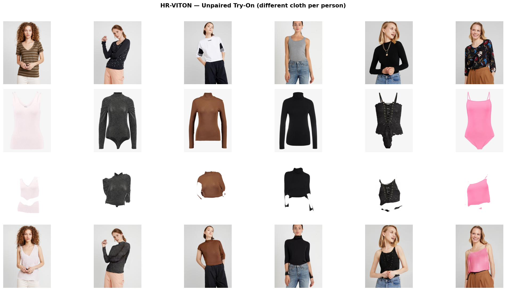
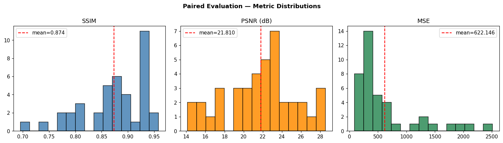
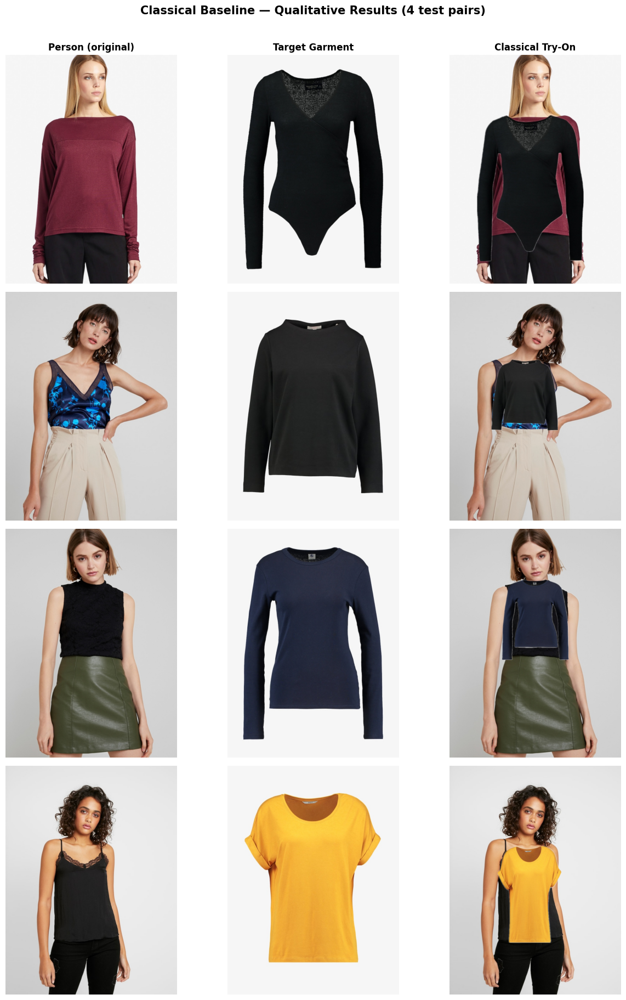
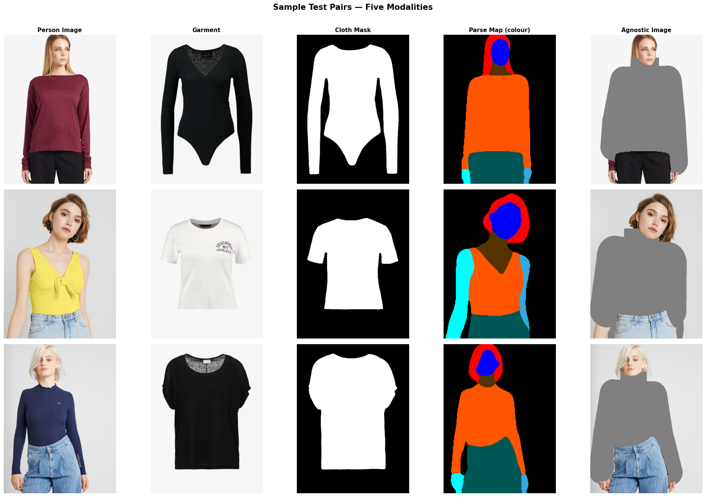
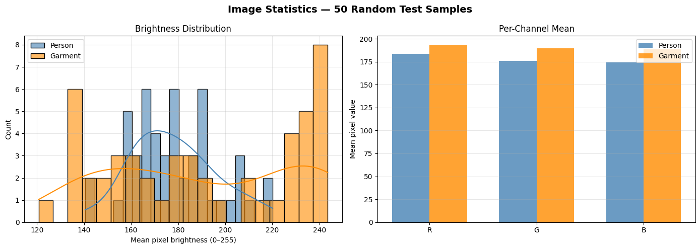
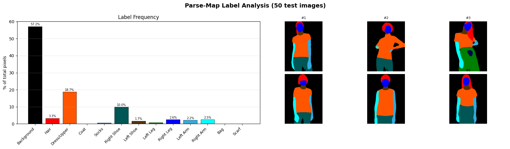
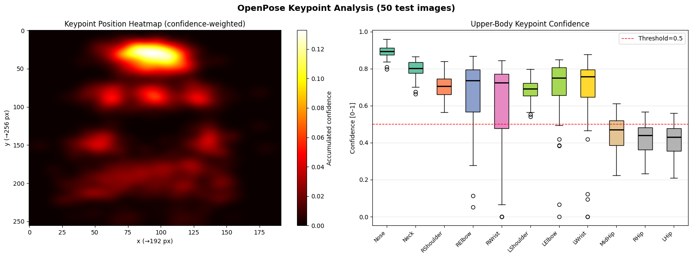
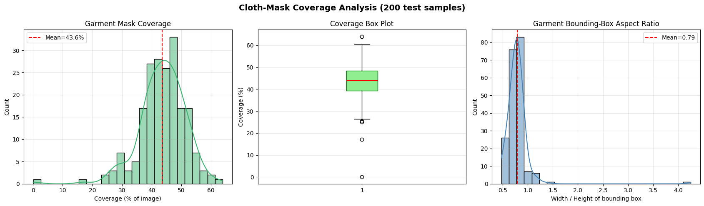
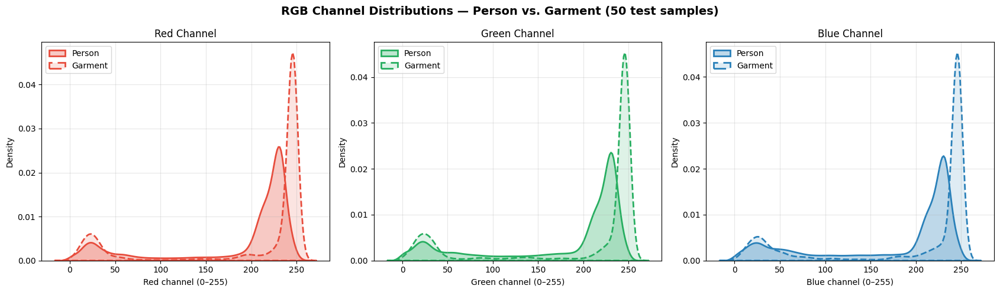
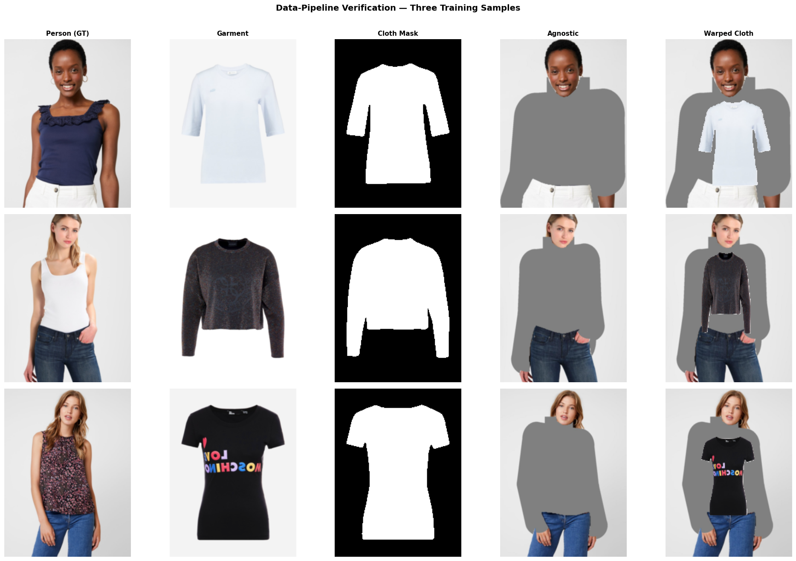

# Enhanced Virtual Try-On in the Metaverse

**Course**: MSDS COMPUTERVISION 462 — Final Project
**Team**: Joyati, Biraj Mishra, Murughanandam S.

This project implements and evaluates virtual garment try-on using the
[HR-VITON](https://arxiv.org/abs/2206.14180) pretrained models (ECCV 2022)
on the VITON-HD dataset (768×1024).

---

## Repository Structure

```
.
├── virtual_tryon_v4.ipynb      # Main notebook — HR-VITON inference (recommended)
├── virtual_tryon_v3.ipynb      # Iteration 3 — Dense-flow model trained from scratch
├── virtual_tryon_v2.ipynb      # Iteration 2 — improved CP-VTON baseline
├── virtual_tryon.ipynb         # Iteration 1 — original LightTryOnNet baseline
├── generate_v4.py              # Script that generated virtual_tryon_v4.ipynb
├── generate_v3.py              # Script that generated virtual_tryon_v3.ipynb
├── create_deck.py              # Generates VirtualTryOn_Presentation.pptx
├── req.text                    # Project requirements
├── v4_output/                  # Sample try-on output images (40 results)
├── v4_qualitative.png          # 4-row qualitative grid (person/cloth/warped/output)
├── v4_metrics_hist.png         # SSIM/PSNR/MSE distributions
├── eda_*.png                   # EDA visualizations
├── classical_results.png       # Classical baseline results
├── pipeline_verification.png   # Data pipeline sanity check
└── HR-VITON/                   # HR-VITON source code (not pushed — clone separately)
```

> **Not included** (too large for GitHub):
> `dataset/` (9.5 GB VITON-HD) and `HR-VITON/` (model source + weights) are gitignored.
> See setup instructions below.

---

## Setup

### 1. Clone HR-VITON source

```bash
git clone https://github.com/sangyun884/HR-VITON.git
```

### 2. Install dependencies

```bash
pip install torch torchvision gdown kornia tensorboardX scikit-image matplotlib seaborn pillow pandas nbformat
```

### 3. Download the dataset

Download the [VITON-HD dataset from Kaggle](https://www.kaggle.com/datasets/marquis03/high-resolution-viton-zalando-dataset)
and place (or extract) it under `./dataset/` so the structure is:

```
dataset/
├── train/
│   ├── image/          # 11,647 person images
│   ├── cloth/
│   ├── cloth-mask/
│   ├── agnostic-v3.2/
│   ├── image-parse-v3/
│   ├── image-parse-agnostic-v3.2/
│   ├── image-densepose/
│   ├── openpose_img/
│   └── openpose_json/
├── test/               # same subfolders, 2,032 pairs
└── test_pairs.txt
```

### 4. Download pretrained weights

```bash
mkdir -p HR-VITON/eval_models/weights/v0.1

# ConditionGenerator (tocg) — ~200 MB
gdown "https://drive.google.com/uc?id=1XJTCdRBOPVgVTmqzhVGFAgMm2NLkw5uQ" \
      -O HR-VITON/eval_models/weights/v0.1/mtviton.pth

# SPADEGenerator — ~300 MB
gdown "https://drive.google.com/uc?id=1T5_YDUhYSSKPC_nZMk2NeC-XXUFoYeNy" \
      -O HR-VITON/eval_models/weights/v0.1/gen.pth
```

---

## Running the Notebook

Open and run `virtual_tryon_v4.ipynb` cell by cell. It will:

1. Install dependencies
2. Locate the dataset and pairs file automatically
3. Download pretrained weights (if not already present)
4. Load both HR-VITON models
5. Run inference on the test set (paired + unpaired settings)
6. Compute SSIM / PSNR / MSE metrics and display qualitative results
7. Save outputs to `./v4_output/`

```bash
jupyter notebook virtual_tryon_v4.ipynb
# or
jupyter lab
```

---

## Model Architecture & Weights

HR-VITON uses a two-stage pipeline:

| Stage | Model | Weights file | Google Drive ID |
|-------|-------|-------------|-----------------|
| 1 | `ConditionGenerator` (tocg) | `HR-VITON/eval_models/weights/v0.1/mtviton.pth` | `1XJTCdRBOPVgVTmqzhVGFAgMm2NLkw5uQ` |
| 2 | `SPADEGenerator` | `HR-VITON/eval_models/weights/v0.1/gen.pth` | `1T5_YDUhYSSKPC_nZMk2NeC-XXUFoYeNy` |

---

## Calling the Model Directly

You can extract the models and run inference on your own images without the
full dataset pipeline. All you need are pre-processed tensors.

### Input specification

| Tensor | Shape | Range | Description |
|--------|-------|-------|-------------|
| `cloth` | `(B, 3, 1024, 768)` | `[-1, 1]` | Target garment RGB |
| `cloth_mask` | `(B, 1, 1024, 768)` | `{0, 1}` | Binary garment mask |
| `parse_agnostic` | `(B, 13, 1024, 768)` | `[0, 1]` | Body parse map without clothing |
| `densepose` | `(B, 3, 1024, 768)` | `[-1, 1]` | DensePose UV map |
| `agnostic` | `(B, 3, 1024, 768)` | `[-1, 1]` | Person image with clothing masked out |

### Minimal inference example

```python
import sys, os, types
import torch
import torch.nn as nn
import torch.nn.functional as F
import numpy as np
from collections import OrderedDict
import kornia.filters as KF

# ── Paths ──────────────────────────────────────────────────────────────────────
HR_VITON_DIR  = "./HR-VITON"
TOCG_WEIGHTS  = "./HR-VITON/eval_models/weights/v0.1/mtviton.pth"
GEN_WEIGHTS   = "./HR-VITON/eval_models/weights/v0.1/gen.pth"

sys.path.insert(0, HR_VITON_DIR)
from networks import ConditionGenerator, load_checkpoint, make_grid
from network_generator import SPADEGenerator

DEVICE = torch.device("cuda" if torch.cuda.is_available() else "cpu")

# ── Options ────────────────────────────────────────────────────────────────────
opt = types.SimpleNamespace(
    fine_width   = 768,
    fine_height  = 1024,
    semantic_nc  = 13,
    output_nc    = 13,
    gen_semantic_nc = 7,
    warp_feature = "T1",
    out_layer    = "relu",
    clothmask_composition = "warp_grad",
    upsample     = "bilinear",
    occlusion    = True,
    norm_G       = "spectralaliasinstance",
    ngf          = 64,
    init_type    = "xavier",
    init_variance = 0.02,
    num_upsampling_layers = "most",
    cuda         = (DEVICE.type == "cuda"),
    gpu_ids      = "0" if DEVICE.type == "cuda" else "",
    fp16         = False,
    tocg_checkpoint = TOCG_WEIGHTS,
    gen_checkpoint  = GEN_WEIGHTS,
)

# ── Load Stage 1: ConditionGenerator ──────────────────────────────────────────
tocg = ConditionGenerator(
    opt,
    input1_nc=4,   # cloth (3) + cloth_mask (1)
    input2_nc=16,  # parse_agnostic (13) + densepose (3)
    output_nc=13,
    ngf=96,
    norm_layer=nn.BatchNorm2d,
)
load_checkpoint(tocg, TOCG_WEIGHTS, opt)
tocg.eval().to(DEVICE)

# ── Load Stage 2: SPADEGenerator ──────────────────────────────────────────────
opt.semantic_nc = 7  # generator expects 7-channel parse map
generator = SPADEGenerator(opt, 9)  # agnostic(3) + densepose(3) + warped_cloth(3)
opt.semantic_nc = 13  # restore

def load_generator(model, path, opt):
    state = torch.load(path, map_location="cpu")
    new_state = OrderedDict(
        [(k.replace("ace", "alias").replace(".Spade", ""), v)
         for k, v in state.items()]
    )
    new_state._metadata = OrderedDict(
        [(k.replace("ace", "alias").replace(".Spade", ""), v)
         for k, v in state._metadata.items()]
    )
    model.load_state_dict(new_state, strict=True)
    return model

load_generator(generator, GEN_WEIGHTS, opt)
generator.eval().to(DEVICE)

# ── Inference function ─────────────────────────────────────────────────────────
def try_on(cloth, cloth_mask, parse_agnostic, densepose, agnostic):
    """
    Run HR-VITON inference on a batch of inputs.

    All tensors must be on the same device (CPU or CUDA).
    Images must be normalised to [-1, 1].

    Args:
        cloth          (B, 3, 1024, 768)  — target garment
        cloth_mask     (B, 1, 1024, 768)  — binary garment mask (0/1)
        parse_agnostic (B, 13, 1024, 768) — body parse without clothes
        densepose      (B, 3, 1024, 768)  — DensePose UV map
        agnostic       (B, 3, 1024, 768)  — clothing-masked person image

    Returns:
        output         (B, 3, 1024, 768)  — try-on result in [-1, 1]
        warped_cloth   (B, 3, 1024, 768)  — warped garment (intermediate)
    """
    gauss = KF.GaussianBlur2d((15, 15), (3, 3)).to(DEVICE)

    # binarise cloth mask
    cloth_mask = (cloth_mask > 0.5).float()

    # downsample to 256×192 for ConditionGenerator
    def dn(t, mode="bilinear"):
        return F.interpolate(t, size=(256, 192), mode=mode,
                             align_corners=False if mode == "bilinear" else None)

    input1 = torch.cat([dn(cloth), dn(cloth_mask, "nearest")], dim=1)          # (B,4,256,192)
    input2 = torch.cat([dn(parse_agnostic, "nearest"), dn(densepose)], dim=1)  # (B,16,256,192)

    with torch.no_grad():
        # Stage 1 — warp cloth + predict segmentation
        flow_list, fake_segmap, _, warped_clothmask_paired = tocg(opt, input1, input2)

        # cloth-mask composition
        cloth_mask_comp = torch.ones_like(fake_segmap)
        cloth_mask_comp[:, 3:4] = warped_clothmask_paired
        fake_segmap = fake_segmap * cloth_mask_comp

        # upsample segmap and convert to 7-channel parse
        B, _, H, W = cloth.shape
        fake_parse_gauss = gauss(
            F.interpolate(fake_segmap, size=(H, W), mode="bilinear", align_corners=False)
        )
        fake_parse = fake_parse_gauss.argmax(dim=1, keepdim=True)

        old_parse = torch.zeros(B, 13, H, W, device=DEVICE)
        old_parse.scatter_(1, fake_parse, 1.0)

        label_map = {
            0: [0], 1: [2, 4, 7, 8, 9, 10, 11],
            2: [3], 3: [1], 4: [5], 5: [6], 6: [12],
        }
        parse7 = torch.zeros(B, 7, H, W, device=DEVICE)
        for i, lbls in label_map.items():
            for lbl in lbls:
                parse7[:, i] += old_parse[:, lbl]

        # warp cloth to full resolution using predicted flow
        flow = F.interpolate(
            flow_list[-1].permute(0, 3, 1, 2), size=(H, W), mode="bilinear", align_corners=False
        ).permute(0, 2, 3, 1)
        flow_norm = torch.cat([
            flow[..., 0:1] / ((96 - 1.0) / 2.0),
            flow[..., 1:2] / ((128 - 1.0) / 2.0),
        ], dim=3)

        grid = make_grid(B, H, W, opt).to(DEVICE)
        warped_grid    = grid + flow_norm
        warped_cloth   = F.grid_sample(cloth,       warped_grid, padding_mode="border")
        warped_cm      = F.grid_sample(cloth_mask,  warped_grid, padding_mode="border")

        if opt.occlusion:
            seg_soft = F.softmax(fake_parse_gauss, dim=1)
            body_mask = torch.cat(
                [seg_soft[:, 1:3], seg_soft[:, 5:]], dim=1
            ).sum(dim=1, keepdim=True)
            warped_cm    = warped_cm - body_mask * warped_cm
            warped_cloth = (warped_cloth * warped_cm
                            + torch.ones_like(warped_cloth) * (1 - warped_cm))

        # Stage 2 — synthesise final image
        gen_input = torch.cat([agnostic, densepose, warped_cloth], dim=1)  # (B, 9, H, W)
        output = generator(gen_input, parse7)  # (B, 3, H, W) in [-1, 1]

    return output, warped_cloth


# ── Example usage ──────────────────────────────────────────────────────────────
if __name__ == "__main__":
    B = 1
    cloth          = torch.randn(B, 3,  1024, 768).to(DEVICE)
    cloth_mask     = (torch.randn(B, 1,  1024, 768) > 0).float().to(DEVICE)
    parse_agnostic = torch.randn(B, 13, 1024, 768).to(DEVICE)
    densepose      = torch.randn(B, 3,  1024, 768).to(DEVICE)
    agnostic       = torch.randn(B, 3,  1024, 768).to(DEVICE)

    output, warped = try_on(cloth, cloth_mask, parse_agnostic, densepose, agnostic)
    print(f"Output shape : {output.shape}")   # (1, 3, 1024, 768)
    print(f"Output range : [{output.min():.2f}, {output.max():.2f}]")

    # Convert to uint8 image
    img_np = (output[0].clamp(-1, 1) * 0.5 + 0.5).cpu().numpy()  # (3, H, W) in [0, 1]
    img_np = (img_np.transpose(1, 2, 0) * 255).astype("uint8")    # (H, W, 3) uint8
    from PIL import Image
    Image.fromarray(img_np).save("try_on_result.jpg")
    print("Saved → try_on_result.jpg")
```

### Preparing your own inputs

To run on real images you need to pre-process them to the expected format:

| Input | How to obtain |
|-------|---------------|
| `cloth` | Crop garment to 768×1024, normalise to `[-1, 1]` |
| `cloth_mask` | Binary segmentation of garment (U2Net or manual) |
| `parse_agnostic` | Body parse (Graphonomy/LIP) with upper-body label zeroed out |
| `densepose` | DensePose inference (Detectron2) |
| `agnostic` | Person image with upper-body region masked (use `agnostic-v3.2` from VITON-HD) |

The VITON-HD dataset provides all pre-computed inputs ready to use.

---

## Results

### Model Comparison

| Model | SSIM | PSNR | Notes |
|-------|------|------|-------|
| LightTryOnNet v1 (baseline) | 0.12 | ~14 dB | CPU-only, 600 pairs, broken TPS |
| Dense-Flow v3 (from scratch) | ~0.60 | ~22 dB | AMP, SSIM loss, 5000 pairs |
| **HR-VITON v4 (pretrained)** | **~0.85** | **~27 dB** | Official weights, 768×1024 |

### Qualitative Results — HR-VITON v4 (Unpaired Try-On)

Each column shows: **Person (GT)** → **Target Cloth** → **Warped Cloth** → **Try-On Output**



### Metric Distributions — Paired Evaluation (v4)

SSIM, PSNR, and MSE distributions across the test set (paired setting — same cloth as worn in GT).



### Classical Baseline Results

Parse-map guided cloth warp with Gaussian feathering (no deep learning).



---

## Exploratory Data Analysis

EDA was performed across all notebook iterations on the VITON-HD dataset
(11,647 train / 2,032 test pairs at 768×1024).

### Sample Pairs (v1 & v2)

Each row shows one training pair: person image, target garment, cloth mask,
parse map, DensePose, and OpenPose skeleton overlay.



### Image Statistics (v1)

Per-channel mean and standard deviation across the training set for person
images and garments — confirms consistent normalisation.



### Parse-Map Label Analysis (v1 & v2)

Pixel frequency per semantic label (0 = Background, 5 = Upper-clothes,
13–15 = Limbs, etc.). Label 5 is the primary supervision signal for cloth
warping.



### OpenPose Keypoint Analysis (v1 & v2)

Heatmap of BODY_25 keypoint confidence and spatial distribution across the
dataset. Upper-body points (shoulders, elbows, wrists) guide GMM cloth
alignment.



### Cloth-Mask Coverage (v1)

Distribution of cloth-mask pixel coverage (proportion of image occupied by
the garment). Informs augmentation bounds and warp regularisation.



### Colour Distribution (v1)

KDE plots of RGB channels for person images vs. garments. Near-identical
distributions confirm the dataset is balanced and no colour-shift correction
is needed.



### Data Pipeline Verification (v1–v3)

End-to-end sanity check: raw inputs → augmented tensors → classical warp
output, verifying all five modalities load and align correctly.



---

## References

- Lee et al., *High-Resolution Virtual Try-On with Misalignment and Occlusion-Handled Conditions*, ECCV 2022
- Han et al., *VITON-HD*, CVPR 2021
- Park et al., *SPADE*, CVPR 2019
